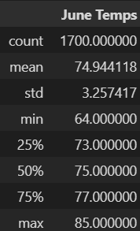
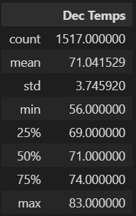

# Surfs_up

## Overview

Our objective in this project was to assist a new surf shop owner by performing an analysis on weather data from Oahu. We used SQLite to perform queries, then used python and pandas to organize data. This information will be helpful in justifying the investment.

## Results

   
Weather Summary from June

   
Weather Summary from December

From the summaries above we can see a few key differences:
- The mean temperature is about 4 degrees warmer in June than December.
- The minimum temperature for December was 56 degrees vs. June's 64 degrees.
- The maximum temperature for June was 85 degrees, the maximum temperature for December was 83 degrees.

## Summary

From our findings, December is slightly cooler than June overall and there are a few days when it might feel chilly. However, most people living in the continental US will realize that this is a very slight temperate difference compared to other locations. Therefore, it is worth saying that by temperature, Hawaii would be a good place to set up a surf shop. This shouldn't be too surprising as Hawaii was where surfing was invented. 